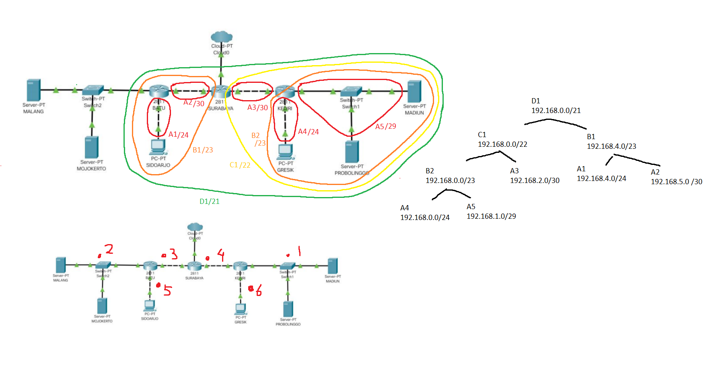
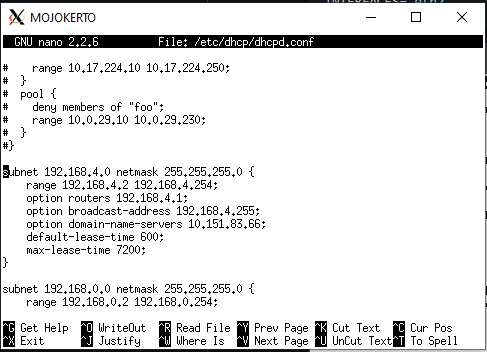
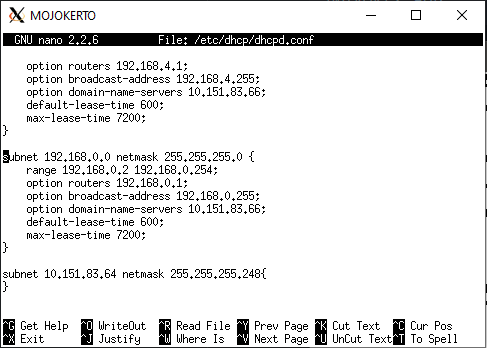

# Jarkom_Modul5_Praktikum_B07
#### Kelompok
* 05111840000060 Edo Dwi Yogatama
* 05111840000091 Vincentius Tanubrata

### A. Tugas pertama kalian yaitu membuat topologi jaringan sesuai dengan rancangan yang diberikan Bibah seperti dibawah ini :

* Membuat ```topology.sh``` yang berisikan command berikut :
```
# Switch
uml_switch -unix switch1 > /dev/null < /dev/null &
uml_switch -unix switch2 > /dev/null < /dev/null &
uml_switch -unix switch3 > /dev/null < /dev/null &
uml_switch -unix switch4 > /dev/null < /dev/null &
uml_switch -unix switch5 > /dev/null < /dev/null &
uml_switch -unix switch6 > /dev/null < /dev/null &

# Router
xterm -T SURABAYA -e linux ubd0=SURABAYA,jarkom umid=SURABAYA eth0=tuntap,,,10.151.74.33 eth1=daemon,,,switch3 eth2=daemon,,,switch4 mem=96M &
xterm -T BATU -e linux ubd0=BATU,jarkom umid=BATU eth0=daemon,,,switch3 eth1=daemon,,,switch2 eth2=daemon,,,switch5 mem=96M &
xterm -T KEDIRI -e linux ubd0=KEDIRI,jarkom umid=KEDIRI eth0=daemon,,,switch4 eth1=daemon,,,switch1 eth2=daemon,,,switch6 mem=96M &

# Server
xterm -T MALANG -e linux ubd0=MALANG,jarkom umid=MALANG eth0=daemon,,,switch2 mem=128M &
xterm -T MOJOKERTO -e linux ubd0=MOJOKERTO,jarkom umid=MOJOKERTO eth0=daemon,,,switch2 mem=128M &
xterm -T MADIUN -e linux ubd0=MADIUN,jarkom umid=MADIUN eth0=daemon,,,switch1 mem=128M &
xterm -T PROBOLINGGO -e linux ubd0=PROBOLINGGO,jarkom umid=PROBOLINGGO eth0=daemon,,,switch1 mem=128M &

# Klien
xterm -T SIDOARJO -e linux ubd0=SIDOARJO,jarkom umid=SIDOARJO eth0=daemon,,,switch5 mem=96M &
xterm -T GRESIK -e linux ubd0=GRESIK,jarkom umid=GRESIK eth0=daemon,,,switch6 mem=96M &
```

### B. karena kalian telah mempelajari Subnetting dan Routing, Bibah meminta kalian untuk membuat topologi tersebut menggunakan teknik CIDR atau VLSM. Setelah melakukan subnetting,



### C. kalian juga diharuskan melakukan routing agar setiap perangkat pada jaringan tersebut dapat terhubung.

* Pada __SURABYA__ membuat ```route.sh```
```
route add -net 192.168.0.0 netmask 255.255.254.0 gw 192.168.2.2
route add -net 192.168.4.0 netmask 255.255.255.0 gw 192.168.5.2
route add -net 10.151.83.64 netmask 255.255.255.248 gw 192.168.5.2
```

### D. Tugas berikutnya adalah memberikan ip pada subnet SIDOARJO dan GRESIK secara dinamis menggunakan bantuan DHCP SERVER (Selain subnet tersebut menggunakan ip static). Kemudian kalian mengingat bahwa kalian harus setting DHCP RELAY pada router yang menghubungkannya, seperti yang kalian telah pelajari di masa lalu.

* Menginstall ```isc-dhcp-server``` pada topology __MOJOKERTO__ 
* selanjutnya menambahkan konfigurasi pada ```/etc/dhcp/dhcpd.conf```




* menginstall ```isc-dhcp-relay``` pada __KEDIRI__ dan __BATU__
* pada __GRESIK__ dan __SIDOARJO__ edit interface di ```/etc/netwok/interfaces```
```
auto eth0
iface eth0 inet dhcp
```

### 1. Agar topologi yang kalian buat dapat mengakses keluar, kalian diminta untuk mengkonfigurasi SURABAYA menggunakan iptables, namun Bibah tidak ingin kalian menggunakan MASQUERADE.

* command dibawah dijalankan di topology __SURABAYA__
```
iptables -t nat -A POSTROUTING -s 192.168.0.0/16 -o eth0 -j SNAT --to-source 10.151.74.34
```

### 2. Kalian diminta untuk mendrop semua akses SSH dari luar Topologi (UML) Kalian pada server yang memiliki ip DMZ (DHCP dan DNS SERVER) pada SURABAYA demi menjaga keamanan.

* command dibawah dijalankan di __SURABAYA__
```
iptables -A FORWARD -p tcp --dport -d 10.151.83.64/29 -i eth0 -j DROP
```
### 3. Karena tim kalian maksimal terdiri dari 3 orang, Bibah meminta kalian untuk membatasi DHCP dan DNS server hanya boleh menerima maksimal 3 koneksi ICMP secara bersamaan yang berasal dari mana saja menggunakan iptables pada masing masing server, selebihnya akan di DROP.

* command dibawah dijalankan di __MOJOKERTO__ dan __MALANG__
```
iptables -A INPUT -p icmp -m conlimit --conlimit-above 3 --conlimit-mask 0 -j REJECT
```
### 4. kemudian kalian diminta untuk membatasi akses ke MALANG yang berasal dari SUBNET SIDOARJO dan SUBNET GRESIK dengan peraturan sebagai berikut: Akses dari subnet SIDOARJO hanya diperbolehkan pada pukul 07.00 - 17.00 pada hari Senin sampai Jumat.

* command dibawah dijalankan di __MALANG__
```
iptables -A INPUT -s 192.168.4.0/24 -m time --weekdays Sat,Sun -j REJECT
iptables -A INPUT -s 192.168.4.0/24 -m time --timestart 07:00 --timestop 17:00 --weekdays Mon,Tue,Wed,Thu,Fri -j ACCEPT
iptables -A INPUT -s 192.168.4.0/24 -m time --timestart 17:01 --timestop 00:00 --weekdays Mon,Tue,Wed,Thu,Fri -j REJECT
iptables -A INPUT -s 192.168.4.0/24 -m time --timestart 00:01 --timestop 06:59 --weekdays Mon,Tue,Wed,Thu,Fri -j REJECT
```

### 5. Akses dari subnet GRESIK hanya diperbolehkan pada pukul 17.00 hingga pukul 07.00 setiap harinya. Selain itu paket akan di REJECT.

* command dibawah dijalankan di __MALANG__
```
iptables -A INPUT -s 192.168.4.0/24 -m time --timestart 17:00 --timestop 00:00 -j ACCEPT
iptables -A INPUT -s 192.168.4.0/24 -m time --timestart 00:01 --timestop 07:00 -j ACCEPT
iptables -A INPUT -s 192.168.4.0/24 -m time --timestart 07:01 --timestop 16:59 -j REJECT
```

### 6. Karena kita memiliki 2 buah WEB Server, Bibah ingin SURABAYA disetting sehingga setiap request dari client yang mengakses DNS Server akan didistribusikan secara bergantian pada PROBOLINGGO port 80 dan MADIUN port 80.
* lakukan `apt-get update` di malang
* install bind 9 di malang dengan `apt-get install bind9 -y`
* buka `/etc/bind/named.conf.local`
* konfigurasi domain jarkom2020.com
```
zone "jarkom2020.com" {
	type master;
	file "/etc/bind/jarkom/jarkom2020.com";
};
```
* buat folder jarkom dengan `mkdir /etc/bind/jarkom`
* copy file dengan `cp /etc/bind/db.local /etc/bind/jarkom/jarkom2020.com`
* buka `/etc/bind/jarkom/jarkom2020.com`
* konfigurasi domain jarkom2020.com dan masukan ip tujuan dalam hal ini kami menggunakan 192.168.1.15 sebagai ip tujuan.
* lakukan service bind9 restart
* install apache2 pada web server madiun dan probolinggo dengan `apt-get install apache2`
* Kemudian setelah melakukan setting pada DNS dan webserver, kita lakukan iptables pada surabaya
```
iptables -A PREROUTING -t nat -p tcp -d 192.168.1.15 --dport 80 -m statistic --mode nth --every 2 --packet 0 -j DNAT --to-destination 192.168.1.2
iptables -A PREROUTING -t nat -p tcp -d 192.168.1.15 --dport 80 -j DNAT --to-destination 192.168.1.3
iptables -t nat -A POSTROUTING -p tcp --dport 80 -d 192.168.1.2 -j SNAT --to-source 192.168.1.15
iptables -t nat -A POSTROUTING -p tcp --dport 80 -d 192.168.1.3 -j SNAT --to-source 192.168.1.15

```

### 7. Bibah ingin agar semua paket didrop oleh firewall (dalam topologi) tercatat dalam log pada setiap UML yang memiliki aturan drop.

* Untuk menyederhanakan, buat file bash dimana berisikan command iptables yang harus dijalan di setiap topology
* setelah itu tambahkan command dibawah di bagian paling atas
```
iptables -N LOGGING
```
* di akhir file tambahkan command berikut, (Chain*DROP* dapat disesuaikan dengan rules yang diperlukan)
```
iptables -A LOGGING -m limit --limit 2/min -j LOG --log-prefix "SSH Refused : " --log-level 4
iptables -A LOGGING -j DROP
```
* lalu ubah *REJECT/DROP* menjadi *LOGGING*
